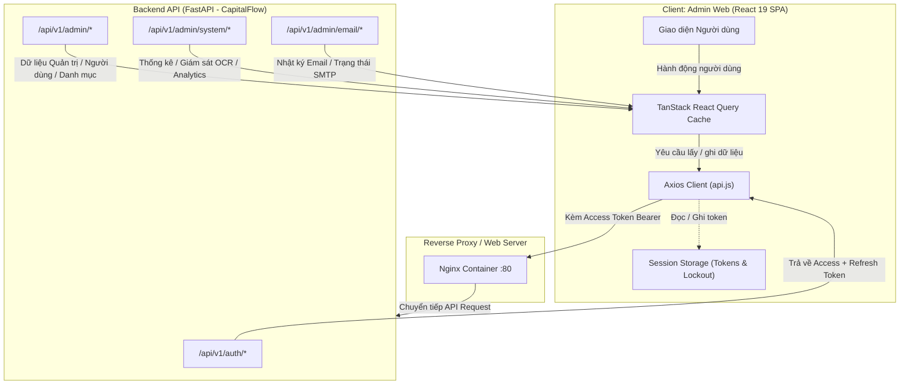

# TỔNG QUAN DỰ ÁN ADMIN-WEB (CAPITALFLOW)
> **Tài liệu Kỹ thuật**: Sơ đồ cấu trúc thư mục, Công nghệ sử dụng, Luồng dữ liệu chính & Nguyên tắc thiết kế (Design Patterns).  
> **Dự án**: CapitalFlow — Hệ thống Quản trị Tài chính Cá nhân Thông minh (Cổng Quản trị Viên - Admin Portal).  
> **Đường dẫn Workspace**: `d:\code\DoAn_KLCN\frontend\admin-web`

---

## 1. Sơ Đồ Cấu Trúc Thư Mục (Directory Structure)

```text
admin-web/
├── .env                          # Cấu hình biến môi trường cục bộ (VITE_API_URL)
├── .gitignore                    # Khai báo file/thư mục bỏ qua trong Git
├── .oxlintrc.json                # Cấu hình kiểm tra cú pháp & chất lượng mã nguồn Oxlint
├── Dockerfile                    # Kịch bản đóng gói Container đa tầng (Node.js build -> Nginx runtime)
├── index.html                    # Điểm neo HTML duy nhất của ứng dụng Single Page Application (SPA)
├── nginx.conf                    # Cấu hình máy chủ web Nginx phục vụ static file và SPA fallback
├── package.json                  # Khai báo thư viện phụ thuộc (dependencies) và scripts
├── package-lock.json             # Khóa phiên bản chi tiết cây phụ thuộc npm
├── vite.config.js                # Cấu hình build tool Vite & plugin React
├── public/                       # Thư mục chứa tài nguyên tĩnh không qua bundling (favicon, logo)
│   └── favicon.svg               # Biểu tượng website
├── src/                          # Toàn bộ mã nguồn chính của ứng dụng
│   ├── App.css                   # Định kiểu CSS tùy biến cấp ứng dụng
│   ├── App.jsx                   # Bộ điều tuyến Router chính, bảo vệ route & phân chia layout
│   ├── index.css                 # Hệ thống Design Tokens, bảng màu Swiss Platinum & Cobalt Blue
│   ├── main.jsx                  # Điểm khởi chạy (Entrypoint) React 19 & QueryClientProvider
│   ├── assets/                   # Chứa hình ảnh, biểu tượng tĩnh được import trong mã nguồn
│   ├── components/               # Các thành phần giao diện tái sử dụng
│   │   ├── DashboardLayout.jsx   # Khung giao diện trung tâm: Sidebar điều hướng, Header, Search & Avatar chip
│   │   ├── ProtectedRoute.jsx    # Component bọc route, kiểm tra token hợp lệ trước khi cho phép truy cập
│   │   └── ui/                   # Thư viện component Atomic UI chia sẻ
│   │       └── index.jsx         # Thẻ hiển thị Badge, Phân trang Pagination, Spinner, EmptyState, StatCard
│   ├── hooks/                    # Các Custom React Hooks
│   │   └── useToast.js           # Hook quản lý và hiển thị thông báo Toast nổi (Success, Error, Warning, Info)
│   ├── pages/                    # Các màn hình nghiệp vụ chính của hệ thống
│   │   ├── Login.jsx             # Trang đăng nhập bảo mật cao, hoạt họa kéo dây đèn, chống Brute-force
│   │   ├── Dashboard.jsx         # Màn hình tổng quan KPI hệ thống, biểu đồ SVG, cảnh báo thời gian thực
│   │   ├── Users.jsx             # Quản lý người dùng toàn diện (Khóa/Mở đơn & hàng loạt, Đổi vai trò, Xuất CSV)
│   │   ├── Categories.jsx        # Quản lý danh mục Thu/Chi mặc định của hệ thống kèm bảng chọn biểu tượng Emoji
│   │   ├── SystemAnalytics.jsx   # Báo cáo phân tích vận hành vĩ mô, biểu đồ Recharts, bảo vệ quyền riêng tư
│   │   ├── OcrMonitor.jsx        # Bảng điều khiển giám sát động cơ AI OCR (Google Gemini), tỷ lệ thành công
│   │   ├── AuditLogs.jsx         # Nhật ký kiểm toán bảo mật bất biến (Audit Trail) của toàn bộ quản trị viên
│   │   ├── EmailLogs.jsx         # Theo dõi lịch sử gửi Email, kiểm thử trực tiếp và cấu hình tham số SMTP
│   │   └── Settings.jsx          # Thiết lập cấu hình hệ thống: Bảo mật, Thông báo, Sao lưu & Chế độ bảo trì
│   └── services/                 # Tầng tương tác mạng & API Client
│       └── api.js                # Cấu hình Axios Instance, đính kèm JWT Bearer, cơ chế tự động xoay vòng Token
└── dist/                         # Thư mục đầu ra sản phẩm sau khi chạy `npm run build`
```

---

## 2. Các Công Nghệ Sử Dụng (Technology Stack)

| Phân loại | Công nghệ / Thư viện | Phiên bản | Vai trò & Mục đích sử dụng |
| :--- | :--- | :--- | :--- |
| **Core Framework** | **React** | `^19.2.8` | Nền tảng xây dựng giao diện người dùng dựa trên Component, hỗ trợ Concurrent Rendering. |
| **DOM Renderer** | **ReactDOM** | `^19.2.8` | Xử lý kết nối giữa React Virtual DOM và trình duyệt web. |
| **Build Tool / Bundler** | **Vite** | `^8.2.0` | Công cụ đóng gói siêu tốc, Hot Module Replacement (HMR) tức thời qua native ES Modules. |
| **Compiler Plugin** | **@vitejs/plugin-react** | `^6.0.4` | Tích hợp React Fast Refresh và tối ưu hóa chuyển dịch JSX thông qua engine Oxc/Babel. |
| **Định tuyến (Routing)** | **React Router DOM** | `^7.18.2` | Quản lý điều hướng đơn trang (SPA), layout lồng nhau (`<Outlet />`) và bảo vệ route (`<ProtectedRoute />`). |
| **Quản lý Server State** | **@tanstack/react-query** | `^5.102.2` | Đồng bộ dữ liệu máy chủ, caching thông minh, auto-polling (15s–60s), xử lý mutations & cache invalidation. |
| **HTTP Client** | **Axios** | `^1.19.0` | Gọi REST API, quản lý Request Interceptor (JWT) và Response Interceptor (Xử lý hàng đợi xoay vòng Refresh Token). |
| **Styling & CSS Utility** | **Tailwind CSS v4** | `^4.3.3` | Hệ thống Utility-first CSS hiện đại, tích hợp trực tiếp qua `@tailwindcss/vite` giúp dựng giao diện linh hoạt. |
| **CSS Component Library** | **Bootstrap** | `^5.3.8` | Cung cấp hệ thống lưới Grid Layout, cấu trúc bảng dữ liệu Table và các lớp tiện ích Form Control. |
| **Popper Engine** | **@popperjs/core** | `^2.11.8` | Hỗ trợ định vị vị trí các phần tử nổi, dropdown và tooltip của Bootstrap. |
| **Trực quan hóa Dữ liệu** | **Recharts** | `^3.10.1` | Vẽ biểu đồ cột phân loại giao dịch (`BarChart`, `Bar`, `XAxis`, `YAxis`, `Tooltip`, `ResponsiveContainer`). |
| **Đồ họa Vector SVG** | **Custom Inline SVG** | Native | Dựng biểu đồ xu hướng đường cong Bézier tùy biến và vòng tròn tiến độ (`OcrProgressRing`) nhẹ, sắc nét. |
| **Hệ thống Biểu tượng** | **Lucide React** | `^1.33.0` | Bộ icon vector nhất quán, hiện đại phục vụ Sidebar, nút bấm hành động và chỉ số KPI. |
| **Linter & Code Quality** | **Oxlint** | `^1.75.0` | Công cụ linter viết bằng Rust cực nhanh, kiểm tra lỗi cú pháp và chuẩn hóa phong cách viết code. |
| **Web Server & Reverse Proxy** | **Nginx (Alpine)** | `1.x-alpine` | Máy chủ web hiệu năng cao phục vụ static bundle, cấu hình định tuyến SPA fallback (`try_files $uri $uri/ /index.html`). |
| **Containerization** | **Docker** | Multi-stage | Đóng gói sản phẩm qua 2 giai đoạn: Builder (Node 20 Alpine) và Runtime (Nginx Alpine) giúp giảm kích thước image. |

---

## 3. Luồng Dữ Liệu Chính (Main Data Flows)



### 3.1. Luồng Xác Thực & Vòng Đời Token (Authentication & Token Lifecycle Flow)
1. **Đăng nhập & Phòng thủ Brute-force**:
   - Quản trị viên nhập thông tin tại `pages/Login.jsx`.
   - Client kiểm tra số lần đăng nhập sai (`failCount`) lưu trong `sessionStorage`. Nếu sai $\ge 5$ lần, kích hoạt chế độ khóa tạm thời (`admin_lock_until`) với đồng hồ đếm ngược (30 giây thử nghiệm / 15 phút thực tế).
   - Gửi yêu cầu `POST /api/v1/auth/login`. Khi nhận JWT token, client gọi ngay `GET /api/v1/auth/me` để thẩm định vai trò: tài khoản bắt buộc phải có quyền `ADMIN` hoặc `SUPER_ADMIN`, nếu không sẽ bị từ chối và tăng biến đếm vi phạm.
2. **Lưu trữ & Bảo vệ Tuyến đường (`ProtectedRoute`)**:
   - `admin_access_token` và `admin_refresh_token` được lưu riêng biệt trong `sessionStorage` (được giải phóng khi đóng tab trình duyệt để nâng cao tính an toàn).
   - `ProtectedRoute.jsx` giám sát mọi tuyến đường con: nếu thiếu Access Token, người dùng lập tức bị chuyển hướng về màn hình đăng nhập `/`.
3. **Cơ chế Tự Động Xoay Vòng Token Chống Nghẽn (Silent Auto-Rotation with Refresh Queue)**:
   - Mọi request gửi đi đều được `api.interceptors.request` tự động gán header `Authorization: Bearer <admin_access_token>`.
   - Khi Access Token hết hạn, backend trả về mã `401 Unauthorized`.
   - `api.interceptors.response` phát hiện lỗi 401 và kiểm tra cờ `isRefreshing`:
     - Nếu đã có một tiến trình refresh đang chạy: các request đến sau được gom vào hàng đợi `refreshQueue = []` dưới dạng các `Promise` chờ giải phóng.
     - Nếu chưa có: kích hoạt cờ `isRefreshing = true` và gọi `POST /api/v1/auth/refresh` kèm `refresh_token`.
     - Sau khi nhận Access Token mới: cập nhật lại `sessionStorage`, giải phóng hàng đợi `refreshQueue` bằng token mới và tự động thực thi lại các request gốc (`originalReq`).
     - Nếu Refresh Token cũng không hợp lệ hoặc đã bị thu hồi (ví dụ: phát hiện tấn công tái sử dụng token): kích hoạt hàm `_doLogout()`, gọi `POST /api/v1/auth/logout`, xóa sạch `sessionStorage` và điều hướng về trang đăng nhập.

### 3.2. Luồng Quản Trị Người Dùng & Điều Hành Tài Khoản (User Management Flow)
1. **Truy vấn & Lọc Thời Gian Thực**:
   - `pages/Users.jsx` sử dụng hook `useQuery` kết nối `GET /api/v1/admin/users` hỗ trợ phân trang (`page`, `page_size`) và tìm kiếm từ khóa (`search`). Thiết lập auto-polling mỗi 20 giây (`refetchInterval: 20000`).
   - Bộ lọc Client-side xử lý tức thời trạng thái Vai trò (Admin / User), Tình trạng tài khoản (Active / Banned) và Trạng thái Trực tuyến (Online / Offline).
   - Trạng thái trực tuyến được đo lường chính xác bằng thuật toán so khớp thời gian UTC: người dùng có hoạt động trong vòng 10 phút gần nhất được tính là Online thông qua bộ đếm thời gian thực `currentTime` (tick mỗi 15 giây).
2. **Thao tác Đơn lẻ & Hàng loạt (Bulk Actions)**:
   - Hỗ trợ chọn từng tài khoản hoặc chọn toàn bộ thông qua Checkbox đa trạng thái (Indeterminate state). Bảo vệ tự động: Tài khoản Root Admin và chính tài khoản Admin đang đăng nhập sẽ bị vô hiệu hóa checkbox nhằm chống tự khóa/xóa.
   - **Khóa tài khoản**: `PATCH /api/v1/admin/users/{id}/ban` hoặc `POST /api/v1/admin/users/bulk-ban` kèm lý do, thời hạn khóa và tùy chọn cưỡng chế đăng xuất tức thì (`force_logout: true`).
   - **Mở khóa tài khoản**: `PATCH /api/v1/admin/users/{id}/unban` hoặc `POST /api/v1/admin/users/bulk-unban` kèm tùy chọn gửi email thông báo tự động.
   - **Cấp lại mật khẩu**: `POST /api/v1/admin/users/{id}/reset-password` tự sinh mật khẩu kích hoạt ngẫu nhiên và gửi thẳng vào hòm thư người dùng.
3. **Xuất Dữ Liệu Báo Cáo CSV Chuẩn UTF-8**:
   - Hàm `exportCSV` hỗ trợ xuất toàn bộ hoặc chỉ các dòng đang chọn.
   - Dữ liệu CSV được chèn mã ký tự **Byte Order Mark** (`\uFEFF`) ở đầu tệp, đảm bảo hiển thị trọn vẹn tiếng Việt có dấu khi mở bằng Microsoft Excel.

### 3.3. Luồng Giám Sát Vận Hành & Đo Lường Kỹ Thuật (Telemetry & AI OCR Flow)
1. **Tổng Quan Dashboard**:
   - `pages/Dashboard.jsx` gọi `GET /api/v1/admin/dashboard/stats` theo chu kỳ 30 giây để cập nhật số lượng người dùng, tổng giao dịch và tỷ lệ thành công của OCR.
2. **Giám Sát Động Cơ Trí Tuệ Nhân Tạo (AI OCR Monitor)**:
   - `pages/OcrMonitor.jsx` gọi `GET /api/v1/admin/system/ocr-monitor` mỗi 30 giây.
   - Trích xuất số liệu tổng hợp: tổng hóa đơn, tỷ lệ phân loại theo trạng thái (`UPLOADED`, `PROCESSING`, `REVIEW_REQUIRED`, `COMPLETED`, `FAILED`), phân bổ lỗi động cơ Gemini và hiển thị biểu đồ vòng tròn tiến độ SVG.
3. **Phân Tích Hệ Thống Vĩ Mô (System Analytics)**:
   - `pages/SystemAnalytics.jsx` gọi `GET /api/v1/admin/system/analytics` mỗi 60 giây.
   - Tuân thủ nguyên tắc bảo mật quyền riêng tư: chỉ phân tích tổng lượng giao dịch Thu/Chi và mức độ phân bổ danh mục phổ biến của toàn hệ thống, tuyệt đối không truy xuất hay hiển thị thông tin nhạy cảm của từng người dùng.

### 3.4. Luồng Quản Lý Máy Chủ Email & Nhật Ký Gửi Thư (Email Management Flow)
1. **Nhật ký Gửi thư (Email Delivery Logs)**:
   - `pages/EmailLogs.jsx` truy xuất `GET /api/v1/admin/email/logs` kèm các tham số lọc: trạng thái (`SENT`, `FAILED`), loại thư (`WELCOME`, `PASSWORD_RESET_OTP`, `BUDGET_ALERT`, `ACCOUNT_BANNED`...) và từ khóa tìm kiếm.
2. **Cấu Hình & Kiểm Thử SMTP**:
   - Đọc và cập nhật cấu hình thông qua `GET` / `PUT /api/v1/admin/email/settings`.
   - Nút kiểm thử tức thời `POST /api/v1/admin/email/test` gửi thư nghiệm thu đến địa chỉ chỉ định, cho biết chế độ thực thi (Console Mock hoặc SMTP Server) và kết quả truyền tin.

---

## 4. Các Nguyên Tắc Thiết Kế (Design Patterns) Đang Áp Dụng

### 4.1. Layout & Outlet Routing Pattern
- **Hiện thực**: Áp dụng trong `src/App.jsx` và `src/components/DashboardLayout.jsx`.
- **Nguyên lý**: Sử dụng cơ chế lồng route của React Router v7. Khung layout `DashboardLayout` chứa Sidebar cố định, Top Navigation, thanh tìm kiếm và Menu người dùng. Các trang con (`Dashboard`, `Users`, `Categories`...) được đưa vào vị trí nội dung linh hoạt thông qua thẻ `<Outlet />`, tránh việc phải render lại khung điều hướng khi chuyển trang.

### 4.2. Token Bucket / Request Queue Interceptor Pattern
- **Hiện thực**: Áp dụng trong `src/services/api.js`.
- **Nguyên lý**: Giải quyết triệt để bài toán Race Condition khi token hết hạn. Nếu có 5 API đồng thời nhận mã lỗi 401, chỉ có đúng 1 request đầu tiên được kích hoạt endpoint refresh token; 4 request còn lại được xếp vào hàng đợi `refreshQueue`. Sau khi có token mới, toàn bộ hàng đợi được đánh thức và gửi lại, người dùng không hề bị gián đoạn trải nghiệm hay nhận thông báo lỗi giả.

### 4.3. Container & Presentational Component Pattern
- **Hiện thực**: Tách biệt rõ ràng giữa các trang nghiệp vụ (`pages/*`) và thư viện thành phần hiển thị (`components/ui/index.jsx`).
- **Nguyên lý**: Các thành phần như `StatCard`, `Badge`, `Pagination`, `Spinner`, `EmptyState` hoàn toàn độc lập với API, chỉ nhận dữ liệu qua `props` để hiển thị. Toàn bộ logic gọi API, mutation và xử lý dữ liệu được đóng gói tại trang quản lý (Container).

### 4.4. Server-State Synchronization & Optimistic Invalidation Pattern
- **Hiện thực**: Khai thác toàn diện qua `@tanstack/react-query`.
- **Nguyên lý**: Dữ liệu phía máy chủ không lưu vào Redux/Zustand mà được quản lý qua cache của TanStack Query. Sau mỗi thao tác Mutation thành công (khóa user, thêm danh mục, lưu SMTP), hệ thống phát lệnh `queryClient.invalidateQueries` để tự động làm mới các tập dữ liệu liên quan (`admin-users`, `admin-dashboard`, `audit-logs`), đảm bảo giao diện luôn phản ánh trạng thái chuẩn xác nhất của cơ sở dữ liệu.

### 4.5. Client-Side Defense-in-Depth Pattern (Phòng thủ Chiều sâu)
- **Hiện thực**: Tích hợp tại `pages/Login.jsx` và `pages/Users.jsx`.
- **Nguyên lý**: Dù Backend luôn kiểm soát bảo mật cuối cùng, Frontend vẫn chủ động thiết lập các chốt chặn phòng ngừa:
  - Khóa form và đếm ngược thời gian khi đăng nhập sai nhiều lần.
  - Ẩn/Vô hiệu hóa quyền chỉnh sửa đối với tài khoản Root/Super Admin (`isRootAdmin`) ngay trên giao diện nhằm loại trừ sai sót thao tác của quản trị viên cấp dưới.
  - Ngăn chặn hành động tự khóa tài khoản của chính mình (`u.id !== currentAdmin?.id`).

### 4.6. Multi-Stage Build & Containerized Deployment Pattern
- **Hiện thực**: File `Dockerfile` và `nginx.conf`.
- **Nguyên lý**:
  - **Stage 1 (Builder)**: Sử dụng base image `node:20-alpine`, thực hiện `npm ci` và `npm run build` để sinh ra thư mục `dist/`.
  - **Stage 2 (Runtime)**: Sử dụng base image siêu nhẹ `nginx:alpine`, chỉ sao chép thư mục `dist/` vào `/usr/share/nginx/html` và nạp file cấu hình `nginx.conf`. Loại bỏ toàn bộ mã nguồn thừa và thư mục `node_modules`, giúp kích thước container tối ưu, bảo mật và khởi động chỉ trong tích tắc.
