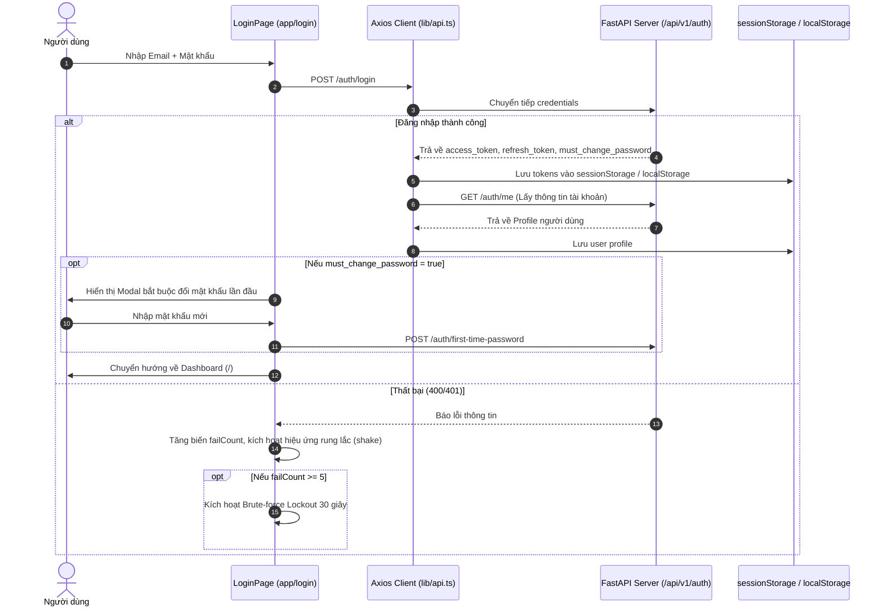
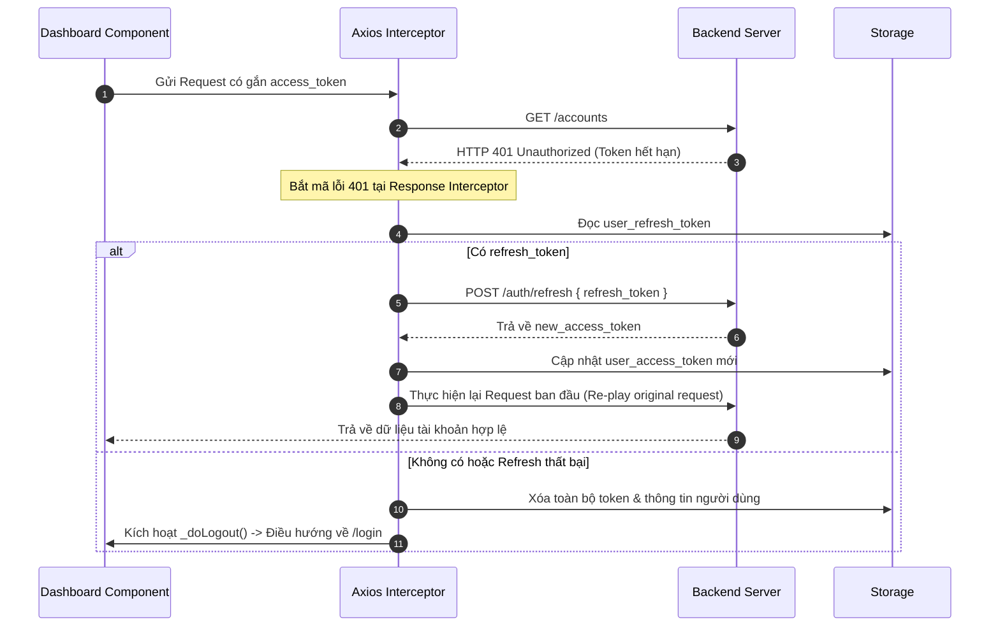
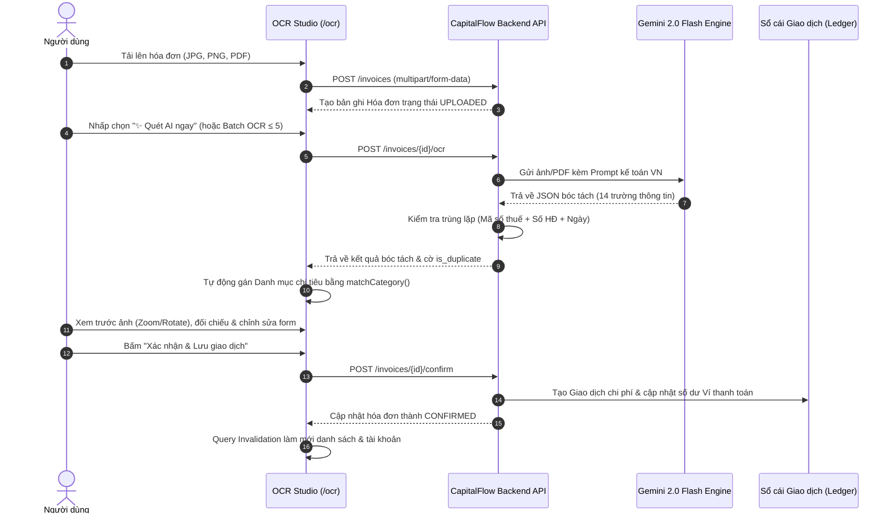

# TỔNG QUAN DỰ ÁN VÀ KIẾN TRÚC HỆ THỐNG (INDEX SUMMARY)
**Dự án:** `user-web` (CapitalFlow User Web Portal)  
**Vị trí trong hệ thống:** Frontend Client dành cho người dùng cuối (End-User Portal) thuộc Hệ sinh thái Quản lý Tài chính & Số hóa Hóa đơn Thông minh **CapitalFlow**.

---

## 1. Sơ đồ cấu trúc thư mục (Directory Structure)

```
user-web/
├── app/                                    # Next.js App Router root
│   ├── (dashboard)/                        # Nhóm route được bảo vệ bởi layout Dashboard
│   │   ├── accounts/                       # Trang quản lý ví và tài khoản ngân hàng
│   │   │   └── page.tsx                    # UI danh sách tài khoản, số dư, loại tài khoản
│   │   ├── analytics/                      # Trang phân tích và báo cáo tài chính
│   │   │   └── page.tsx                    # Biểu đồ Recharts (cơ cấu chi tiêu, xu hướng 6 tháng)
│   │   ├── budgets/                        # Trang thiết lập và theo dõi ngân sách
│   │   │   └── page.tsx                    # Tiến độ chi tiêu theo danh mục, cảnh báo vượt ngưỡng
│   │   ├── categories/                     # Trang quản lý danh mục thu/chi
│   │   │   └── page.tsx                    # Danh sách và tạo mới danh mục
│   │   ├── ocr/                            # Trạm số hóa hóa đơn AI (Invoice OCR Studio)
│   │   │   └── page.tsx                    # Upload, xem trước file, quét AI, chỉnh sửa & tạo giao dịch
│   │   ├── settings/                       # Trang cài đặt cá nhân & hệ thống
│   │   │   └── page.tsx                    # Thiết lập tài khoản người dùng
│   │   ├── support/                        # Trung tâm trợ giúp & liên hệ hỗ trợ
│   │   │   └── page.tsx                    # Hỗ trợ khách hàng
│   │   ├── transactions/                   # Trang lịch sử giao dịch & sổ cái
│   │   │   └── page.tsx                    # Bộ lọc đa chiều, tìm kiếm, phân trang giao dịch
│   │   ├── layout.tsx                      # Layout bọc cho nhóm (dashboard), tích hợp DashboardLayout
│   │   └── page.tsx                        # Dashboard Overview: Tổng tài sản, dòng tiền, giao dịch mới
│   ├── login/                              # Cổng xác thực người dùng (Auth Portal)
│   │   └── page.tsx                        # Đăng nhập, Đăng ký, Quên MK (OTP), Đổi MK lần đầu
│   ├── favicon.ico                         # Favicon ứng dụng
│   ├── globals.css                         # CSS toàn cục (Tailwind v4, theme tokens, animations)
│   ├── layout.tsx                          # Root Layout (Metadata, Providers wrapper, lang="vi")
│   └── providers.tsx                       # TanStack React Query Client Provider setup
├── components/                             # Các UI Components tái sử dụng
│   ├── DashboardLayout.tsx                 # Shell giao diện Dashboard (Sidebar, Header, Profile, Modals)
│   ├── ErrorBoundary.tsx                   # React Error Boundary bắt lỗi runtime giao diện
│   ├── FileList.tsx                        # Danh sách file hóa đơn tải lên với trạng thái xử lý
│   ├── ResultsTable.tsx                    # Bảng dữ liệu hóa đơn cho phép inline-editing từng ô
│   └── UploadZone.tsx                      # Khu vực kéo thả tải lên file hóa đơn (Drag & Drop)
├── data/                                   # Thư mục lưu trữ dữ liệu cục bộ / file tạm
│   ├── uploads/                            # Thư mục chứa các tệp ảnh/PDF hóa đơn tải lên
│   └── results.csv                         # File kết quả trích xuất hóa đơn mẫu (15 cột dữ liệu)
├── lib/                                    # Tiện ích, cấu hình kết nối và logic nghiệp vụ
│   ├── api.ts                              # Axios instance, Interceptors JWT, Auto Refresh Token, Logout
│   ├── gemini.ts                           # Module kết nối Google Gemini API OCR (gemini-2.0-flash)
│   ├── ocr-parse.ts                        # Parser chuẩn hóa chuỗi JSON, làm sạch số tiền, map mảng CSV
│   ├── ollama.ts                           # Module kết nối Ollama Local LLM (kiểm tra nhất quán & fallback)
│   ├── paths.ts                            # Định nghĩa đường dẫn tuyệt đối cho thư mục data/uploads/csv
│   └── ui-helpers.ts                       # Helper hàm băm màu sắc (getHashColor) & map icon (Lucide)
├── public/                                 # Static assets (SVG icons, graphics)
├── .env                                    # Cấu hình biến môi trường cục bộ
├── Dockerfile                              # Multi-stage Docker build cho môi trường production
├── eslint.config.mjs                       # Cấu hình kiểm tra cú pháp ESLint
├── next.config.ts                          # Cấu hình Next.js (Standalone output, Redirects)
├── package.json                            # Khai báo dependencies, scripts chạy ứng dụng
├── postcss.config.mjs                      # Cấu hình PostCSS với @tailwindcss/postcss
├── tsconfig.json                           # Cấu hình TypeScript compiler & alias path @/*
└── vitest.config.ts                        # Cấu hình chạy Unit Test bằng Vitest
```

---

## 2. Các công nghệ sử dụng (Tech Stack & Libraries)

| Thành phần / Tầng | Công nghệ / Thư viện | Phiên bản | Vai trò & Mục đích sử dụng |
| :--- | :--- | :--- | :--- |
| **Core Framework** | **Next.js** (App Router) | `16.3.1` | Khung ứng dụng React hiện đại, hỗ trợ routing lồng nhau, SSR/CSR tối ưu, build độc lập (standalone output). |
| **UI Library** | **React** / **React DOM** | `19.2.8` | Thư viện xây dựng giao diện người dùng theo component hướng trạng thái. |
| **Ngôn ngữ** | **TypeScript** | `^5` | Đảm bảo tính toàn vẹn kiểu dữ liệu (Static Typing), giảm thiểu lỗi runtime. |
| **Styling** | **Tailwind CSS** | `^4.0` | Utility-first CSS framework thế hệ mới với CSS native variables và `@theme inline`. |
| **State & Data Fetching** | **@tanstack/react-query** | `^5.102.2` | Quản lý server state, tự động cache, retry, refetch định kỳ và background revalidation. |
| **HTTP Client** | **Axios** | `^1.19.0` | Gửi HTTP requests, xử lý Request Interceptor (đính kèm Bearer Token) và Response Interceptor (Refresh Token rotation). |
| **Motion & Animation** | **Framer Motion** | `^13.1.1` | Hiệu ứng chuyển động mượt mà: Modal transition, Spring physics 3D Parallax cho Auth card, Animated Progress bars. |
| **Icons** | **Lucide React** | `^1.33.0` | Bộ icon SVG đồng nhất cho toàn bộ giao diện bảng điều khiển, ví, hóa đơn, danh mục. |
| **Data Visualization** | **Recharts** | `^3.10.1` | Vẽ biểu đồ trực quan hóa dữ liệu: Biểu đồ tròn (Pie/Donut Chart) cho cơ cấu chi tiêu, Biểu đồ cột (Bar Chart) cho dòng tiền 6 tháng. |
| **CSV Parser** | **PapaParse** | `^5.6.0` | Đọc, phân tích và xuất dữ liệu giao dịch / kết quả OCR dạng tệp CSV. |
| **AI Integration** | **Google Gemini API** & **Ollama** | REST API | Trích xuất OCR thông minh qua Gemini 2.0 Flash và chuẩn hóa logic kế toán cục bộ qua Ollama (`qwen2.5:4b`). |
| **Containerization** | **Docker** (Node 20 Alpine) | Multi-stage | Đóng gói môi trường production chạy độc lập trên cổng `3010`. |
| **Unit Testing** | **Vitest** | `^4.1.10` | Chạy kiểm thử đơn vị nhanh trong môi trường Node.js. |

---

## 3. Luồng dữ liệu chính (Core Data Flows)

### 3.1. Luồng Xác thực & Quản lý Phiên (Authentication & Session Flow)


### 3.2. Luồng Tự động Làm mới Token (Silent Token Refresh via Interceptor)


### 3.3. Luồng Số hóa & Xử lý Hóa đơn AI (AI OCR Invoice Workflow)


---

## 4. Các nguyên tắc thiết kế & Design Patterns đang áp dụng

### 4.1. Interceptor Pattern & Request Queue Pattern
* **Áp dụng tại:** [`lib/api.ts`](file:///d:/code/DoAn_KLCN/frontend/user-web/lib/api.ts)
* **Chi tiết:**
  - **Request Interceptor:** Tự động tiêm Bearer Token lấy từ `sessionStorage` vào Header của mỗi request ra ngoài nếu chưa có.
  - **Response Interceptor:** Chặn mã lỗi `401 Unauthorized`. Nếu nhiều request cùng thất bại đồng thời, hệ thống sử dụng một mảng hàng đợi `refreshQueue` chứa các Promise resolver, ngăn chặn gọi endpoint `/auth/refresh` trùng lặp, sau đó replay toàn bộ request ban đầu bằng token mới.

### 4.2. Container / Presentational Component Pattern
* **Áp dụng tại:**
  - `app/(dashboard)/ocr/page.tsx`: Đóng vai trò Container điều phối truy vấn dữ liệu (`useQuery`), mutation (`useMutation`), quản lý trạng thái chọn, form và zoom ảnh.
  - `components/FileList.tsx`, `components/ResultsTable.tsx`, `components/UploadZone.tsx`: Là các Pure/Presentational Components chỉ nhận props và phát sự kiện qua callback (`onUploaded`, `onRunOne`, `onSave`), không phụ thuộc trực tiếp vào API bên ngoài.

### 4.3. Provider Pattern
* **Áp dụng tại:** [`app/providers.tsx`](file:///d:/code/DoAn_KLCN/frontend/user-web/app/providers.tsx)
* **Chi tiết:** Bọc toàn bộ ứng dụng trong `QueryClientProvider`, khởi tạo một phiên bản `QueryClient` duy nhất thông qua `useState` để chia sẻ cache dữ liệu xuyên suốt các trang mà không gây re-instantiation khi component re-render.

### 4.4. Graceful Degradation & Fallback Pattern
* **Áp dụng tại:**
  - [`lib/ollama.ts`](file:///d:/code/DoAn_KLCN/frontend/user-web/lib/ollama.ts): Khi gọi Ollama để chuẩn hóa dữ liệu, nếu server cục bộ không chạy hoặc gặp lỗi mạng, hàm `refineWithOllama` bắt exception và trả về kết quả JSON gốc từ Gemini thay vì làm dừng luồng nghiệp vụ.
  - [`app/(dashboard)/ocr/page.tsx`](file:///d:/code/DoAn_KLCN/frontend/user-web/app/(dashboard)/ocr/page.tsx): Hàm `matchCategory` sử dụng bảng từ khóa (heuristics) khớp danh mục. Nếu AI không gợi ý hoặc không khớp từ khóa, hệ thống tự động fallback về danh mục mặc định.

### 4.5. Optimistic Invalidation & Cache Synchronization Pattern
* **Áp dụng tại:** [`app/(dashboard)/ocr/page.tsx`](file:///d:/code/DoAn_KLCN/frontend/user-web/app/(dashboard)/ocr/page.tsx)
* **Chi tiết:** Sau khi xác nhận hóa đơn thành công (`confirmMutation`), hệ thống đồng loạt invalidate 3 query keys: `['invoices']`, `['accounts']`, và `['transactions']`. Điều này đảm bảo khi người dùng chuyển tab, dữ liệu số dư ví và sổ cái giao dịch lập tức phản ánh dữ liệu mới nhất mà không cần tải lại toàn bộ trang.

### 4.6. Error Boundary Pattern
* **Áp dụng tại:** [`components/ErrorBoundary.tsx`](file:///d:/code/DoAn_KLCN/frontend/user-web/components/ErrorBoundary.tsx)
* **Chi tiết:** Bắt các ngoại lệ JavaScript runtime không mong muốn trong component tree, hiển thị giao diện thông báo thân thiện và nút "Thử lại", ngăn chặn hiện tượng "màn hình trắng" (White Screen of Death).

### 4.7. Security By Design (Bảo mật theo thiết kế)
* **Client-side Brute-force Prevention:** Giới hạn 5 lần đăng nhập sai, khóa tạm thời 30 giây lưu theo timestamp tại `sessionStorage`.
* **Token Isolation:** Tách biệt `sessionStorage` (phiên duyệt web an toàn) và `localStorage` (tùy chọn "Ghi nhớ đăng nhập").
* **Force Password Reset:** Cưỡng chế người dùng đổi mật khẩu khởi tạo (`must_change_password`) trước khi truy cập dữ liệu tài chính.
